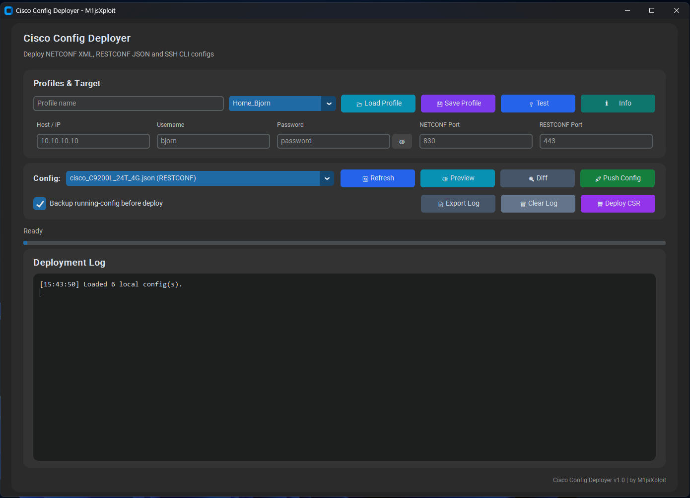

# Cisco Config Deployer

Modern Python GUI for deploying Cisco IOS-XE configurations using **NETCONF**, **RESTCONF** and **SSH CLI**, with support for local/GitHub config files and automated CSR1000v KVM deployment.



---

## 📘 Overview

Cisco Config Deployer is a lab-focused network automation tool for deploying reusable Cisco configurations to routers and switches.

The project is designed for Cisco IOS-XE environments and supports:

- NETCONF XML configuration files
- RESTCONF JSON configuration files
- SSH CLI `.cli` command files
- Local config caching
- GitHub-based config synchronization
- Deployment logging
- Running-config backups
- CSR1000v VM deployment through KVM/libvirt

The goal is to keep network configurations centralized, version-controlled and easy to deploy through a modern GUI.

---

## 📂 Repository Structure

```text
Cisco-Config-Deployer/
│
├── main.py
├── gui.py
├── constants.py
│
├── services/
│   ├── netconf_service.py
│   ├── restconf_service.py
│   ├── ssh_service.py
│   ├── github_service.py
│   ├── backup_service.py
│   └── vm_deployer.py
│
├── utils/
│   ├── profiles.py
│   ├── network.py
│   └── config_loader.py
│
├── Configs/
│   ├── *.xml
│   ├── *.json
│   └── *.cli
│
├── backups/
├── csr1000v_profiles.json
└── README.md
```

---

## ⚙️ Supported Config Types

| File Type | Protocol | Use |
|---|---|---|
| `.xml` | NETCONF | IOS-XE YANG XML configuration |
| `.json` | RESTCONF | IOS-XE RESTCONF JSON payloads |
| `.cli` | SSH | Traditional Cisco CLI commands |

---

## 🧩 Included Configuration Examples

Examples may include:

- Hostname configuration
- Interface descriptions
- Interface IP addressing
- VLAN creation
- Switchport access VLAN configuration
- Trunk port configuration
- OSPF routing
- Static routes
- RESTCONF compatible configs
- NETCONF compatible configs
- SSH CLI switch configuration files
- Full IOS-XE lab deployments

---

## ✅ Prerequisites

### Device Requirements

- Cisco IOS-XE device or CSR1000v
- Reachable management IP address
- Valid username and password
- NETCONF, RESTCONF or SSH enabled
- Correct management ports open
- Management interface reachable from the deployment machine

---

## 🔐 Cisco Configuration Example

Enable NETCONF, RESTCONF and SSH access:

```cisco
conf t
!
hostname CSR1000v
!
username bjorn privilege 15 secret YourPassword
!
ip domain-name lab.local
crypto key generate rsa modulus 2048
ip ssh version 2
!
netconf-yang
!
restconf
ip http secure-server
ip http authentication local
!
end
wr
```

---

## 🌐 Common Default Ports

| Protocol | Default Port |
|---|---|
| SSH | 22 |
| NETCONF | 830 |
| RESTCONF HTTPS | 443 |

Custom ports can be configured in the GUI profiles.

---

## 🐍 Python Requirements

Install required Python modules:

```bash
pip install customtkinter requests ncclient paramiko
```

Optional but useful for KVM/CSR1000v VM deployment:

```bash
sudo apt install qemu-kvm libvirt-daemon-system libvirt-clients virtinst
```

---

## 🖥 Cisco Config Deployer GUI

The GUI allows you to select a configuration file, preview it, compare it with the running configuration and deploy it to the target device.

### Main Features

- Modern dark-mode GUI
- Local config loading from `Configs/`
- GitHub config synchronization
- NETCONF XML deployment
- RESTCONF JSON deployment
- SSH CLI `.cli` deployment
- Device profiles
- Save/load profiles
- Password visibility toggle
- Test connection
- Device info retrieval
- Preview configuration
- Diff viewer
- Backup running-config before deployment
- Export deployment logs
- Clear deployment logs
- Live deployment progress
- Detailed NETCONF/RESTCONF replies in the log

---

## 🔁 NETCONF Deployment

NETCONF deployments support:

- Candidate datastore detection
- Candidate lock/unlock
- `edit-config`
- validation
- commit
- fallback/error logging
- full NETCONF RPC replies in the deployment log

Example log output:

```text
Candidate datastore supported. Using candidate + commit.
Locking candidate datastore...
NETCONF lock reply: <ok/>
Loading config into candidate...
NETCONF edit-config reply: <ok/>
Validating candidate configuration...
NETCONF validate reply: <ok/>
Committing candidate to running...
NETCONF commit reply: <ok/>
Unlocking candidate datastore...
NETCONF deployment successful.
```

---

## 🌍 RESTCONF Deployment

RESTCONF deployments support:

- JSON payload parsing
- hostname configuration
- interface configuration
- optional IP configuration
- optional OSPF configuration
- full RESTCONF URL logging
- HTTP status code logging
- response body logging

RESTCONF deployments can work with both L3 interface configs and switch-style interface descriptions without IP addressing.

Example log output:

```text
RESTCONF planned change:
Method: PATCH
URL: https://10.10.10.10:443/restconf/data/Cisco-IOS-XE-native:native
Payload:
{
    "Cisco-IOS-XE-native:native": {
        "hostname": "SW-RESTCONF-DEMO"
    }
}

Configure hostname status: 204
Response body: <empty>
```

---

## 💻 SSH CLI Deployment

`.cli` files are deployed through SSH using Paramiko.

This is useful for traditional Cisco switch configuration tasks such as:

- VLAN creation
- Access port configuration
- Trunk port configuration
- Interface descriptions
- Basic CLI-based lab tasks

Example `.cli` file:

```cisco
conf t
!
vlan 10
 name USERS
!
vlan 20
 name SERVERS
!
interface GigabitEthernet1/0/1
 description ACCESS VLAN 10
 switchport mode access
 switchport access vlan 10
 no shutdown
!
end
wr
```

---

## 🖥 CSR1000v VM Deployment

The tool also includes automated CSR1000v deployment through KVM/libvirt.

The VM deployer can:

- Connect to a KVM host over SSH
- Read XML from a base CSR1000v VM
- Clone the QCOW2 disk
- Generate a new VM XML
- Generate new MAC addresses
- Force compatible KVM/libvirt settings
- Define the new VM
- Start the new VM
- Detect the DHCP IP address
- Insert the discovered IP into the GUI target field

Example deployment flow:

```text
Connecting to KVM host...
Reading XML from base VM...
Cloning disk...
Generating new VM XML...
Uploading generated XML...
Defining VM...
Starting VM...
Waiting for DHCP lease...
DHCP IP found.
VM deployed successfully.
```

---

## 🧪 Example Workflow

1. Add `.xml`, `.json` or `.cli` files to the `Configs/` folder
2. Start the GUI
3. Load or create a device profile
4. Select the config file
5. Preview the config
6. Optionally open the diff viewer
7. Enable or disable running-config backup
8. Push the config
9. Review NETCONF/RESTCONF/SSH output in the deployment log
10. Export the log if needed

---

## 🔄 GitHub Sync

The GUI can refresh configs from GitHub and store them locally in the `Configs/` folder.

GitHub is only contacted when using the **Refresh** button.

Local configs are loaded automatically when the GUI starts.

---

## 🧰 Technologies Used

- Python
- CustomTkinter
- Paramiko
- Requests
- ncclient
- Cisco IOS-XE
- NETCONF
- RESTCONF
- SSH
- YANG models
- GitHub
- KVM/libvirt
- CSR1000v

---

## 📌 Notes

- This project is intended for lab and educational environments.
- Always verify IP addresses, credentials and ports before deployment.
- Test configurations in a non-production environment first.
- Saved profiles may store passwords in plain text for lab convenience.
- Do not use plain text credential storage in production.
- Some YANG paths differ between Cisco IOS-XE versions and platforms.
- RESTCONF `204 No Content` responses are normal for successful changes.
- CSR1000v often uses serial console instead of graphical VNC output.
- Config files are cached locally in the `Configs/` folder.

---

## 👨‍💻 Author

**Bjorn Mijs**  
GitHub: [MijsBjornPXL](https://github.com/MijsBjornPXL)

---

## ⭐ Version Control

All changes are tracked through GitHub commits for rollback, versioning and collaboration.